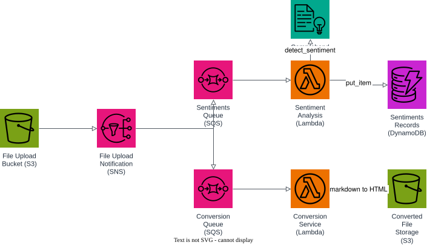

# AWS Project: Serverless File Conversion

Event-driven markdown pipeline with Floci and Terraform:

1. a markdown file lands in the upload bucket;
2. S3 publishes the event to an SNS topic, which fans out to two SQS queues;
3. the sentiment analysis Lambda calls Comprehend and stores the result in DynamoDB;
4. the conversion Lambda renders the markdown to HTML and stores it in the destination bucket.

## Prerequisites

- Docker
- Terraform 1.5+
- AWS CLI
- Python 3.12+ with `pip` on PATH (used by Terraform to vendor the `markdown` dependency for the conversion Lambda)

## Start Floci

```bash
docker compose up -d
```

## Apply Terraform

```bash
terraform init
terraform apply
```

## Architecture



A markdown upload lands in the File Upload Bucket (S3), which publishes to the File Upload Notification (SNS) topic. SNS fans out to two SQS queues: the Sentiments Queue feeds the Sentiment Analysis Lambda, which calls Comprehend and writes to the Sentiments Records (DynamoDB) table; the Conversion Queue feeds the Conversion Service Lambda, which renders markdown to HTML and stores it in the Converted File Storage (S3) bucket.

The diagram source is a real, editable [draw.io](https://www.drawio.com/) file at [docs/architecture.drawio](docs/architecture.drawio), generated programmatically with the [drawpyo](https://github.com/MerrimanInd/drawpyo) Python library. Open the `.drawio` file directly on GitHub or with the draw.io desktop app / [app.diagrams.net](https://app.diagrams.net/) to edit it.

To regenerate the diagram (`.drawio` source + the `.svg`/`.png` embedded above) after changing the architecture:

```bash
python3 -m venv .diagram-venv
.diagram-venv/bin/pip install drawpyo
.diagram-venv/bin/python scripts/generate_diagram.py

# rasterize the .drawio file to svg/png (used by the README) via headless draw.io
docker run --rm -v "$PWD/docs":/data -w /data rlespinasse/drawio-export -f svg -o . --output-mode relative --remove-page-suffix .
docker run --rm -v "$PWD/docs":/data -w /data rlespinasse/drawio-export -f png -o . --output-mode relative --remove-page-suffix -t .
```

## Test the pipeline

Upload a markdown file to trigger both lanes:

```bash
export ENDPOINT=http://localhost:4566
export UPLOAD_BUCKET=$(terraform output -raw file_upload_bucket_name)
export CONVERTED_BUCKET=$(terraform output -raw converted_file_storage_bucket_name)
export TABLE_NAME=$(terraform output -raw sentiments_table_name)

cat > note.md <<'EOF'
# Great news

This release makes our platform faster, more reliable, and delightful to use.
EOF

aws --endpoint-url "$ENDPOINT" s3 cp ./note.md "s3://$UPLOAD_BUCKET/note.md"
rm -f ./note.md
```

Check the converted HTML file and the recorded sentiment:

```bash
aws --endpoint-url "$ENDPOINT" s3 cp "s3://$CONVERTED_BUCKET/note.html" ./note.html
cat ./note.html
rm -f ./note.html

aws --endpoint-url "$ENDPOINT" dynamodb get-item \
  --table-name "$TABLE_NAME" \
  --key '{"fileKey": {"S": "note.md"}}'
```

If you want to follow the execution, watch the Floci container logs:

```bash
docker compose logs -f floci
```

## Clean up

```bash
terraform destroy
docker compose down
```
